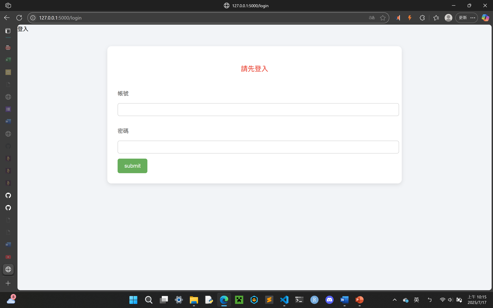
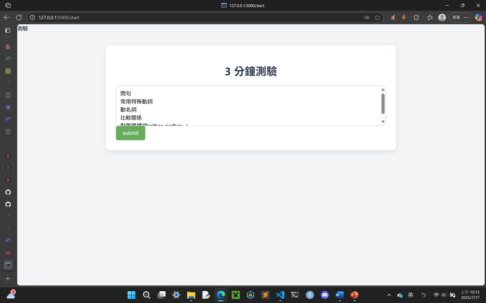
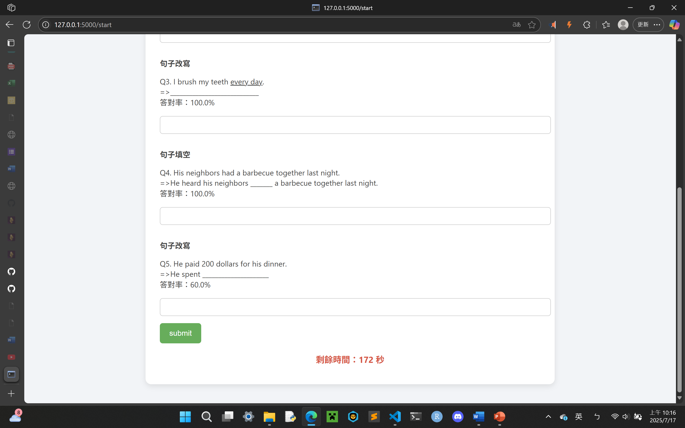
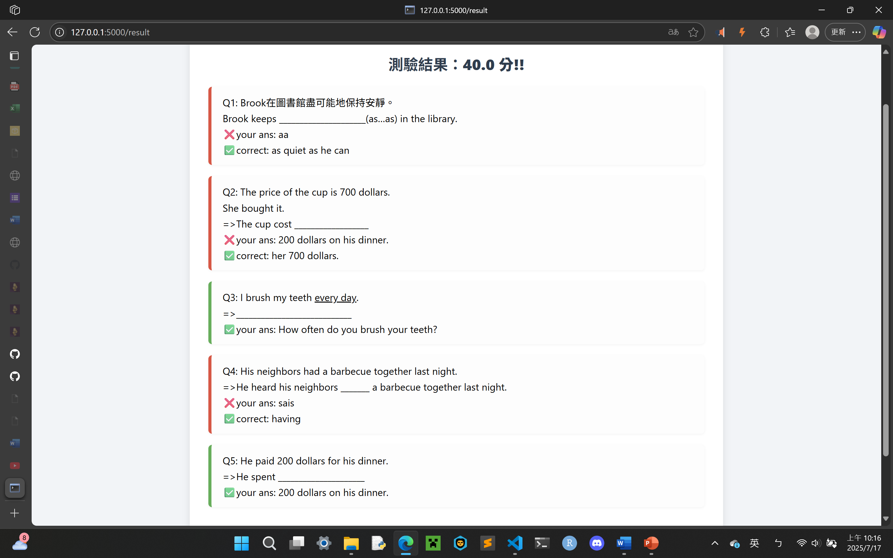
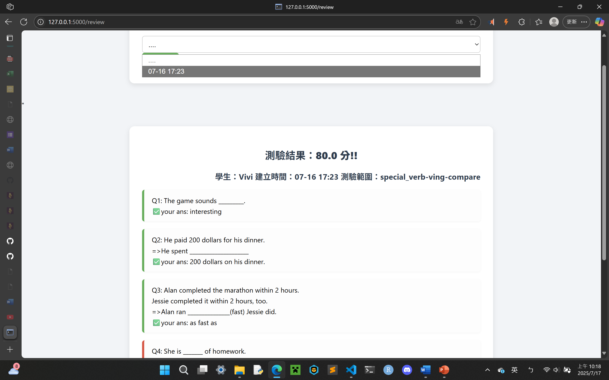
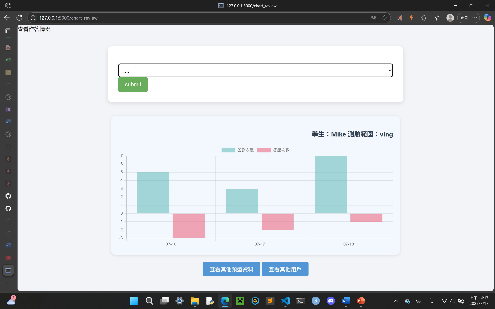

## Flask 英語學習與測驗系統

### 一、專案簡介

本專案是一個基於 Python Flask 框架開發的英語學習與測驗平台，提供使用者線上學習、測驗、歷史紀錄追蹤、成績統計圖表等功能。

### 二、專案目標

* 提供互動式英語題庫進行即時測驗。
* 提供不同類型的題型（填空、重組句子、改寫、單選題），增進使用者學習效果。
* 利用資料庫記錄使用者學習狀況，進行數據分析與視覺化。

### 三、技術架構

* **前端技術**：HTML、CSS、JavaScript、Chart.js
* **後端技術**：Python、Flask、SQLAlchemy
* **資料庫**：SQLite

### 四、系統功能與實作細節

#### 1. 使用者登入系統

* Session管理登入狀態。
* Flask Session與Flash機制進行帳密驗證。

#### 2. 測驗功能

* 隨機挑選題目形成測驗題組。
* 時間限制自動提交。
* 結果即時顯示，標示對錯，提供正確答案。

#### 3. 歷史紀錄與統計功能

* 使用SQLAlchemy將歷史測驗紀錄儲存於SQLite資料庫。
* 使用BeautifulSoup從HTML儲存的歷史測驗結果中動態提取並顯示。
* 利用Chart.js生成使用者歷史紀錄的統計長條圖。

#### 4. 資料庫設計

* `User`：儲存使用者基本資料及歷史成績紀錄。
* `Question`：儲存題庫資料及答對錯次數統計。
* `Record`：儲存每次測驗的結果與建立時間。

#### 5. 系統架構圖

* 前端 → Flask 路由 → 處理資料邏輯 → 資料庫存取 → 呈現於前端（HTML/CSS/JavaScript）。
